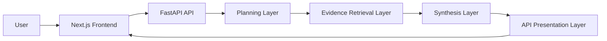
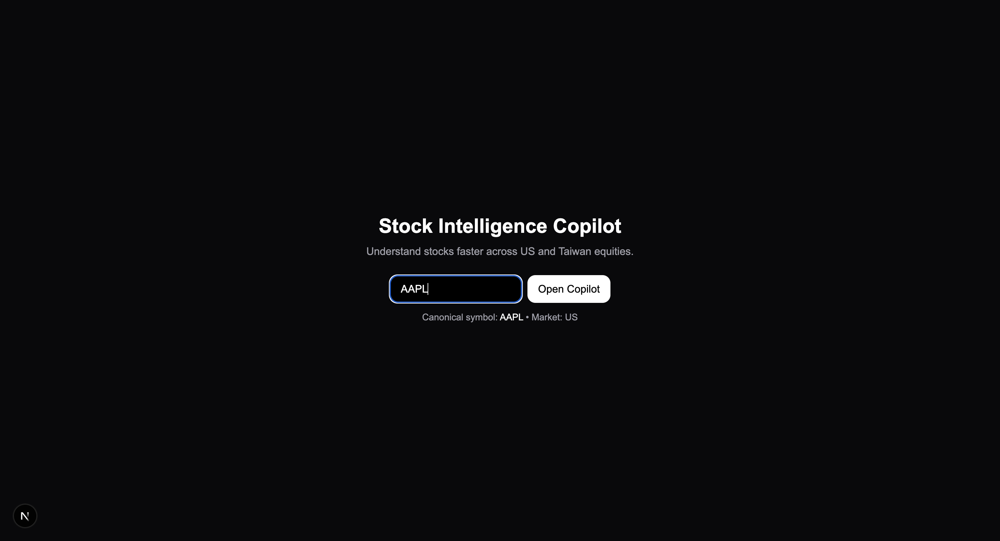

# Stock Intelligence Copilot

Stock Intelligence Copilot is a full-stack equity analysis app with a FastAPI backend and a Next.js frontend. It supports research, price-move explanation, trade setup generation, watchlist monitoring, live reasoning timelines, and both US and Taiwan stock inputs.

## Overview

The project combines:

- A modular backend pipeline for query interpretation, planning, evidence retrieval, synthesis, and API presentation
- A frontend copilot UI with live streaming updates and graceful fallback when SSE is unavailable
- Support for US symbols such as `NVDA` and Taiwan inputs such as `2330`, `2330.TW`, and `台積電`

## Architecture



Backend responsibilities are intentionally separated:

- `backend/pipeline/planning.py`: query interpretation and execution planning
- `backend/pipeline/retrieval.py`: tool routing and evidence aggregation
- `backend/pipeline/synthesis.py`: final answer generation
- `backend/pipeline/orchestrator.py`: end-to-end execution and streaming events
- `backend/api/presentation.py`: safe JSON/SSE presentation and fallback shaping

## Key Features

- Research workflow for fundamental and news-based stock analysis
- Explain workflow for price-move attribution with ranked drivers
- Trade workflow for structured setup generation
- Watchlist workflow for multi-symbol monitoring
- Taiwan stock normalization and market detection
- Structured reasoning timeline in the UI without exposing hidden chain-of-thought
- Streaming backend events with graceful fallback to standard responses

## Supported Ticker Formats

- US symbols: `NVDA`, `AAPL`, `TSLA`
- Taiwan numeric codes: `2330`, `2317`, `2454`
- Taiwan Yahoo Finance symbols: `2330.TW`, `2317.TW`, `2454.TW`
- Taiwan company names and aliases: `台積電`, `鴻海`, `聯發科`, `TSMC`, `Foxconn`, `MediaTek`

Examples:

- `2330` -> `2330.TW`
- `台積電` -> `2330.TW`
- `TSMC` -> `2330.TW`
- `NVDA` -> `NVDA`

## Project Structure

```text
stock_intelligence_copilot/
├── backend/
│   ├── api/
│   ├── chains/
│   ├── pipeline/
│   ├── schemas/
│   ├── services/
│   ├── tools/
│   ├── symbols.py
│   └── main.py
├── frontend/stock-ui/
├── tests/
├── .github/workflows/ci.yml
├── Dockerfile
├── Makefile
├── docker-compose.yml
├── pyproject.toml
└── requirements.txt
```

## Environment Variables

Use either the root reference file or the backend-specific example:

```bash
cp .env.example .env
cp backend/.env.example backend/.env
```

The backend loads variables from `backend/.env`.

Required:

- `OPENAI_API_KEY`
- `ALPHA_VANTAGE_API_KEY`

Optional:

- `LANGCHAIN_API_KEY`
- `LANGCHAIN_TRACING_V2`
- `LANGCHAIN_PROJECT`
- `BACKEND_CORS_ORIGINS`

## Local Setup

### Prerequisites

- Python 3.11+
- Node.js 20+ or 22+
- npm

### Install

Backend:

```bash
python3 -m venv .venv
./.venv/bin/pip install -r requirements.txt
```

Frontend:

```bash
cd frontend/stock-ui
npm ci
```

Or use the Makefile:

```bash
make install-backend
make install-frontend
```

## Run Locally

### Backend API

```bash
./.venv/bin/python -m uvicorn backend.main:app --reload --host 0.0.0.0 --port 8000
```

### Frontend

```bash
cd frontend/stock-ui
npm run dev
```

Open:

- Frontend: [http://localhost:3000](http://localhost:3000)
- Backend docs: [http://localhost:8000/docs](http://localhost:8000/docs)

### CLI

```bash
./.venv/bin/python backend/main.py research NVDA
./.venv/bin/python backend/main.py explain 2330
./.venv/bin/python backend/main.py trade TSLA
./.venv/bin/python backend/main.py watchlist AAPL NVDA 2330
```

### Handy Commands

```bash
make run-backend
make run-frontend
make test
make lint
```

## Tests

Run backend tests:

```bash
./.venv/bin/python -m unittest discover -s tests -v
```

Or:

```bash
make test
```

## Linting

Backend:

```bash
./.venv/bin/python -m ruff check backend tests
```

Frontend:

```bash
cd frontend/stock-ui
npm run lint
```

Both:

```bash
make lint
```

## Docker

### Full Stack with Docker Compose

```bash
docker compose up --build
```

Services:

- Frontend: [http://localhost:3000](http://localhost:3000)
- Backend: [http://localhost:8000](http://localhost:8000)

### Backend Container Only

Build:

```bash
docker build -t stock-intelligence-copilot:local .
```

Run:

```bash
docker run --rm -p 8080:8080 --env-file backend/.env stock-intelligence-copilot:local
```

## GitHub Publication

Recommended steps:

```bash
git init
git add .
git commit -m "Initial public release"
git branch -M main
git remote add origin <your-github-repo-url>
git push -u origin main
```

This repo includes a minimal CI workflow at `.github/workflows/ci.yml` that runs:

- backend tests
- backend Ruff lint
- frontend ESLint

Before publishing, make sure you do not commit real secrets. This repo should use:

- `.env.example`
- `backend/.env.example`
- local `backend/.env` only on your machine or in secret managers

## Deployment

### Google Cloud Run

Cloud Run is the recommended deployment target for the backend.

1. Authenticate and set your project:

```bash
gcloud auth login
gcloud config set project <PROJECT_ID>
```

2. Enable required services:

```bash
gcloud services enable run.googleapis.com cloudbuild.googleapis.com artifactregistry.googleapis.com
```

3. Build the container from the repo root:

```bash
gcloud builds submit --tag gcr.io/<PROJECT_ID>/stock-intelligence-copilot
```

4. Deploy to Cloud Run:

```bash
gcloud run deploy stock-intelligence-copilot \
  --image gcr.io/<PROJECT_ID>/stock-intelligence-copilot \
  --platform managed \
  --region <REGION> \
  --allow-unauthenticated \
  --set-env-vars OPENAI_API_KEY=<OPENAI_API_KEY>,ALPHA_VANTAGE_API_KEY=<ALPHA_VANTAGE_API_KEY>
```

Optional LangSmith variables:

```bash
gcloud run services update stock-intelligence-copilot \
  --region <REGION> \
  --update-env-vars LANGCHAIN_API_KEY=<LANGCHAIN_API_KEY>,LANGCHAIN_TRACING_V2=true,LANGCHAIN_PROJECT=stock-copilot,BACKEND_CORS_ORIGINS=https://<your-frontend-origin>
```

You can also use the Makefile helper:

```bash
make cloudrun-deploy PROJECT_ID=<PROJECT_ID> REGION=<REGION> SERVICE=stock-intelligence-copilot
```

### Frontend Hosting

The current frontend is a dynamic Next.js application and is not configured for static export. Because of that:

- GitHub Pages cannot host the full application as-is
- The backend must run on Cloud Run or another server environment
- A frontend-only GitHub Pages deployment would require converting the app to a static export workflow first

If you want a hosted frontend today, use a platform that supports Next.js directly, or deploy the frontend separately from the backend.

## Demo Screenshots

Place screenshots in this section before publishing:

- `docs/screenshots/home.png`
- `docs/screenshots/copilot-research.png`
- `docs/screenshots/copilot-explain.png`
- `docs/screenshots/copilot-trade.png`

Example placeholder:

```md

```

## Troubleshooting

### Missing environment variables

Symptoms:

- backend startup succeeds but requests fail
- news or synthesis endpoints return fallback responses

Check:

- `backend/.env` exists
- `OPENAI_API_KEY` is set
- `ALPHA_VANTAGE_API_KEY` is set

### CORS issues

Symptoms:

- frontend cannot call the backend from `localhost:3000`

Check:

- backend is running on port `8000`
- frontend is running on port `3000`
- `BACKEND_CORS_ORIGINS` includes your deployed frontend origin if you deploy beyond local development

### Streaming fallback

Symptoms:

- timeline does not stream live
- UI still returns a final answer through fallback mode

This is expected when:

- SSE is blocked by the environment
- a proxy buffers the response
- the streaming endpoint errors and the UI falls back to standard JSON

### Cloud Run startup problems

Symptoms:

- container fails health checks
- service does not become ready

Check:

- the service listens on `$PORT` (the root `Dockerfile` does)
- required env vars are configured in Cloud Run
- the image was built from the repo root, not the frontend subdirectory
- logs via:

```bash
gcloud run services logs read stock-intelligence-copilot --region <REGION>
```
