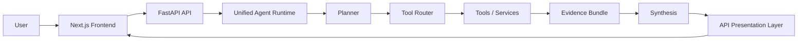
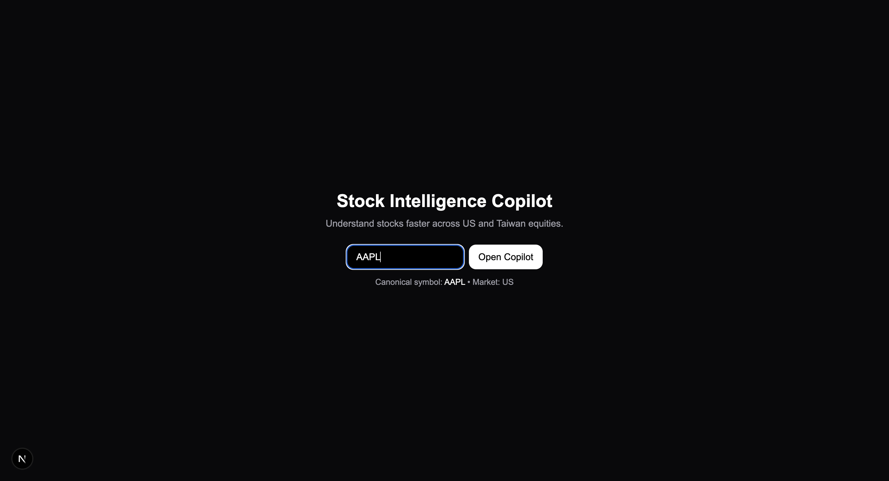

# Stock Intelligence Copilot

Stock Intelligence Copilot is a full-stack equity and portfolio intelligence app with a FastAPI backend and a Next.js frontend. It supports ticker research, price-move explanation, trade setup generation, watchlist monitoring, personal portfolio analysis, scenario simulation, live reasoning timelines, and both US and Taiwan market inputs.

## Overview

The project combines:

- A modular backend agent runtime for task interpretation, planning, tool routing, evidence building, synthesis, and API presentation
- A frontend copilot UI with live streaming updates and graceful fallback when SSE is unavailable
- Support for US symbols such as `NVDA` and Taiwan inputs such as `2330`, `00878`, `00687B`, `2330.TW`, and `台積電`
- A deterministic portfolio calculator plus portfolio scenario analysis layer

## Architecture


```mermaid
flowchart LR
    U["User"] --> F["Next.js Frontend"]
    F --> A["FastAPI API"]
    A --> AR["Unified Agent Runtime"]
    AR --> P["Planner"]
    P --> TR["Tool Router"]
    TR --> T["Tools / Services"]
    T --> EB["Evidence Bundle"]
    EB --> S["Synthesis"]
    S --> AP["API Presentation Layer"]
    AP --> F
```

Backend responsibilities are intentionally separated:

- `backend/pipeline/agent_runtime.py`: unified task execution contract for ticker and portfolio tasks
- `backend/pipeline/planning.py`: query interpretation and execution planning
- `backend/pipeline/retrieval.py`: tool routing and evidence aggregation
- `backend/pipeline/synthesis.py`: unified synthesis entrypoint plus legacy ticker synthesis
- `backend/pipeline/orchestrator.py`: end-to-end execution and streaming events
- `backend/api/presentation.py`: safe JSON/SSE presentation and fallback shaping

## Unified Runtime Migration Status

Non-streaming routes:
- research: runtime
- explain: runtime
- trade: runtime
- watchlist: runtime
- portfolio: runtime

Streaming routes:
- research: runtime streaming adapter
- explain: runtime streaming adapter
- trade: runtime streaming adapter
- watchlist: no public stream route

The runtime streaming adapter currently emits compatibility-focused milestones that preserve the existing SSE event contract for the frontend. Deeper tool-level or step-by-step runtime streaming can be expanded later without changing the public streaming routes.

The current runtime supports these task types through a shared contract:

- research
- explain
- trade
- watchlist
- portfolio_analysis
- portfolio_scenario
- portfolio_scenarios_compare
- portfolio_agent

## Key Features

- Research workflow for fundamental and news-based stock analysis
- Explain workflow for price-move attribution with ranked drivers
- Trade workflow for structured setup generation
- Watchlist workflow for multi-symbol monitoring
- Portfolio workflow for holdings analysis and reallocation scenarios
- Portfolio persistence for local single-user demo mode
- Portfolio agent recommendations backed by deterministic metrics plus tool evidence
- Taiwan stock normalization and market detection
- Structured reasoning timeline in the UI without exposing hidden chain-of-thought
- Streaming backend events with graceful fallback to standard responses

## Supported Ticker Formats

- US symbols: `NVDA`, `AAPL`, `TSLA`
- Taiwan numeric codes: `2330`, `2317`, `2454`
- Taiwan ETF / fund codes: `00878`, `00687B`
- Taiwan Yahoo Finance symbols: `2330.TW`, `2317.TW`, `2454.TW`
- Taiwan company names and aliases: `台積電`, `鴻海`, `聯發科`, `TSMC`, `Foxconn`, `MediaTek`

Examples:

- `2330` -> `2330.TW`
- `台積電` -> `2330.TW`
- `TSMC` -> `2330.TW`
- `NVDA` -> `NVDA`

## Project Structure

```text
stock_intelligence_copilot/
├── backend/
│   ├── api/
│   ├── chains/
│   ├── pipeline/
│   ├── schemas/
│   ├── services/
│   ├── tools/
│   ├── symbols.py
│   └── main.py
├── frontend/stock-ui/
├── tests/
├── AGENTS.md
├── SKILL.md
├── .github/workflows/ci.yml
├── Dockerfile
├── Makefile
├── docker-compose.yml
├── pyproject.toml
└── requirements.txt
```

## Environment Variables

Use either the root reference file or the backend-specific example:

```bash
cp .env.example .env
cp backend/.env.example backend/.env
```

The backend loads variables from `backend/.env`.

Required:

- `OPENAI_API_KEY`
- `ALPHA_VANTAGE_API_KEY`
- `NEXT_PUBLIC_BACKEND_BASE_URL` for deployed frontend builds

Optional:

- `LANGCHAIN_API_KEY`
- `LANGCHAIN_TRACING_V2`
- `LANGCHAIN_PROJECT`
- `BACKEND_CORS_ORIGINS`
- `ENABLE_LLM_TRADE_SYNTHESIS`

For deployed frontends, set the backend origin explicitly:

```bash
NEXT_PUBLIC_BACKEND_BASE_URL=https://your-backend.example.com
```

The frontend app appends `/api` internally.

## Trade Synthesis Modes

Trade mode uses deterministic synthesis by default for production and demo reliability. This is the recommended setting because it does not depend on an external LLM/provider call.

An optional LLM-backed trade synthesis path remains available behind a feature flag:

```bash
ENABLE_LLM_TRADE_SYNTHESIS=true
```

Use `ENABLE_LLM_TRADE_SYNTHESIS=false` for the stable default. Treat the LLM trade path as optional and experimental.

## Product Modes

### Research Mode

- Analyze any supported US/TW stock, ETF, or fund by ticker
- Explain price moves
- Generate trade setups
- Monitor watchlists

### Portfolio Mode

- Input holdings with ticker, cost, shares, value, category, and notes
- Calculate unrealized P/L, dividend estimates, and allocation weights
- Review concentration and defensive allocation risk
- Run sell/buy reallocation scenarios and compare before vs after
- Save and reload a local demo portfolio
- Ask a portfolio agent grounded questions about reallocation ideas

## Local Setup

### Prerequisites

- Python 3.11+
- Node.js 20+ or 22+
- npm

### Install

Backend:

```bash
python3 -m venv .venv
./.venv/bin/pip install -r requirements.txt
```

Frontend:

```bash
cd frontend/stock-ui
npm ci
```

Or use the Makefile:

```bash
make install-backend
make install-frontend
```

If `ruff` is missing locally even though it is listed in `requirements.txt`, refresh the backend environment with:

```bash
make install-backend
```

## Run Locally

### Backend API

```bash
./.venv/bin/python -m uvicorn backend.main:app --reload --host 0.0.0.0 --port 8000
```

Key routes:

- `POST /api/research`
- `POST /api/explain`
- `POST /api/trade`
- `POST /api/watchlist`
- `POST /api/portfolio/analyze`
- `POST /api/portfolio/scenario`
- `POST /api/portfolio/scenarios/compare`
- `POST /api/portfolio/agent`
- `POST /api/portfolio/save`
- `GET /api/portfolio/current`
- `PUT /api/portfolio/current`
- `DELETE /api/portfolio/current`
- `GET /api/portfolio/list`

### Frontend

Before opening the frontend in a browser, read the local memory-safe workflow in
[Local Development Troubleshooting](docs/local-dev-troubleshooting.md).

```bash
cd frontend/stock-ui
npm run dev
```

After curl checks pass, open:

- Frontend: [http://localhost:3000](http://localhost:3000)
- Backend docs: [http://localhost:8000/docs](http://localhost:8000/docs)

### CLI

```bash
./.venv/bin/python backend/main.py research NVDA
./.venv/bin/python backend/main.py explain 2330
./.venv/bin/python backend/main.py trade TSLA
./.venv/bin/python backend/main.py watchlist AAPL NVDA 2330
```

### Handy Commands

```bash
make run-backend
make run-frontend
make test
make lint
```

## Tests

Run backend tests:

```bash
./.venv/bin/python -m unittest discover -s tests -v
```

Or:

```bash
make test
```

## Linting

Backend:

```bash
./.venv/bin/python -m ruff check backend tests
```

Frontend:

```bash
cd frontend/stock-ui
npm run lint
```

Both:

```bash
make lint
```

## Financial Disclaimer

This project provides analysis, scenario comparison, and portfolio intelligence support. It does not provide guaranteed outcomes or personalized regulated investment advice. Missing data, estimated dividends, and market tool gaps should be reviewed before making real capital allocation decisions.

## Portfolio Health Score

Portfolio mode includes heuristic health scoring:

- `overall_score`
- `diversification_score`
- `concentration_score`
- `income_score`
- `defensive_score`
- `growth_score`

These scores are deterministic and useful for comparison, but they are not objective investment ratings.

## Exposure Heuristic Limitations

Theme, category, market, and defensive labels are heuristic. They are designed to be easy to extend and useful for portfolio review, but they do not replace a full holdings look-through system for every ETF or fund.

## Example Portfolio Questions

- Should I sell part of 00878 and move into a Taiwan technology fund?
- How much annual dividend would I lose if I sell half of my income ETF?
- Is my portfolio too concentrated in AI / technology?
- Which losing positions deserve review first?

## Docker

### Full Stack with Docker Compose

```bash
docker compose up --build
```

Services:

- Frontend: [http://localhost:3000](http://localhost:3000)
- Backend: [http://localhost:8000](http://localhost:8000)

### Backend Container Only

Build:

```bash
docker build -t stock-intelligence-copilot:local .
```

Run:

```bash
docker run --rm -p 8080:8080 --env-file backend/.env stock-intelligence-copilot:local
```

## GitHub Publication

Recommended steps:

```bash
git init
git add .
git commit -m "Initial public release"
git branch -M main
git remote add origin <your-github-repo-url>
git push -u origin main
```

This repo includes a minimal CI workflow at `.github/workflows/ci.yml` that runs:

- backend tests
- backend Ruff lint
- frontend ESLint

Before publishing, make sure you do not commit real secrets. This repo should use:

- `.env.example`
- `backend/.env.example`
- local `backend/.env` only on your machine or in secret managers

## Deployment

### GitHub Pages for Frontend Only

This repository contains the full stack in one repo, but GitHub Pages should be used only for the static frontend export. The backend must run separately on Google Cloud Run.

The Pages workflow builds the frontend from `frontend/stock-ui` and publishes the generated `out/` directory. The expected Pages URL is:

- `https://yuni-wyx.github.io/StockIntelligenceCopilot/`

Before enabling the Pages workflow, add this repository variable in GitHub:

- `NEXT_PUBLIC_BACKEND_BASE_URL=https://stock-intelligence-copilot-168709263927.us-central1.run.app`

The frontend will call the backend through that Cloud Run URL.

The frontend app always appends `/api` internally, so the actual explain endpoint used in production is:

- `POST https://stock-intelligence-copilot-168709263927.us-central1.run.app/api/explain`

The bare path below is not a valid frontend target:

- `POST https://stock-intelligence-copilot-168709263927.us-central1.run.app/explain`

### Google Cloud Run

Cloud Run is the recommended deployment target for the backend.

1. Authenticate and set your project:

```bash
gcloud auth login
gcloud config set project <PROJECT_ID>
```

2. Enable required services:

```bash
gcloud services enable run.googleapis.com cloudbuild.googleapis.com artifactregistry.googleapis.com secretmanager.googleapis.com
```

3. Build the container from the repo root:

```bash
gcloud builds submit --tag gcr.io/<PROJECT_ID>/stock-intelligence-copilot
```

4. Create secrets:

```bash
printf '%s' '<OPENAI_API_KEY>' | gcloud secrets create OPENAI_API_KEY --data-file=-
printf '%s' '<ALPHA_VANTAGE_API_KEY>' | gcloud secrets create ALPHA_VANTAGE_API_KEY --data-file=-
```

5. Grant the runtime service account access:

```bash
gcloud projects add-iam-policy-binding <PROJECT_ID> \
  --member="serviceAccount:<PROJECT_NUMBER>-compute@developer.gserviceaccount.com" \
  --role="roles/secretmanager.secretAccessor"
```

6. Deploy to Cloud Run:

```bash
gcloud run deploy stock-intelligence-copilot \
  --image gcr.io/<PROJECT_ID>/stock-intelligence-copilot \
  --platform managed \
  --region <REGION> \
  --allow-unauthenticated \
  --set-env-vars BACKEND_CORS_ORIGINS=https://yuni-wyx.github.io,LANGCHAIN_TRACING_V2=false,LANGCHAIN_PROJECT=stock-copilot \
  --update-secrets OPENAI_API_KEY=OPENAI_API_KEY:latest,ALPHA_VANTAGE_API_KEY=ALPHA_VANTAGE_API_KEY:latest
```

You can also use the Makefile helper:

```bash
make cloudrun-deploy PROJECT_ID=<PROJECT_ID> REGION=<REGION> SERVICE=stock-intelligence-copilot
```

Optional LangSmith variables can be added later with:

```bash
printf '%s' '<LANGCHAIN_API_KEY>' | gcloud secrets create LANGCHAIN_API_KEY --data-file=-

gcloud run services update stock-intelligence-copilot \
  --region <REGION> \
  --update-env-vars LANGCHAIN_TRACING_V2=true,LANGCHAIN_PROJECT=stock-copilot \
  --update-secrets LANGCHAIN_API_KEY=LANGCHAIN_API_KEY:latest
```

## Demo Screenshots

Place screenshots in this section before publishing:

- `docs/screenshots/home.png`
- `docs/screenshots/copilot-research.png`
- `docs/screenshots/copilot-explain.png`
- `docs/screenshots/copilot-trade.png`

Example placeholder:

```md

```

## Troubleshooting

### Missing environment variables

Symptoms:

- backend startup succeeds but requests fail
- news or synthesis endpoints return fallback responses

Check:

- `backend/.env` exists
- `OPENAI_API_KEY` is set
- `ALPHA_VANTAGE_API_KEY` is set
- `NEXT_PUBLIC_BACKEND_BASE_URL` is set for any deployed frontend build

### CORS issues

Symptoms:

- frontend cannot call the backend from `localhost:3000`

Check:

- backend is running on port `8000`
- frontend is running on port `3000`
- `BACKEND_CORS_ORIGINS` includes your deployed frontend origin if you deploy beyond local development
- for GitHub Pages, set `BACKEND_CORS_ORIGINS=https://yuni-wyx.github.io`

### Streaming fallback

Symptoms:

- timeline does not stream live
- UI still returns a final answer through fallback mode

This is expected when:

- SSE is blocked by the environment
- a proxy buffers the response
- the streaming endpoint errors and the UI falls back to standard JSON

### Cloud Run startup problems

Symptoms:

- container fails health checks
- service does not become ready

Check:

- the service listens on `$PORT` (the root `Dockerfile` does)
- required env vars are configured in Cloud Run
- the image was built from the repo root, not the frontend subdirectory
- logs via:

```bash
gcloud run services logs read stock-intelligence-copilot --region <REGION>
```

## Roadmap

- Add authenticated user accounts and saved portfolios
- Improve provider redundancy for market data and news
- Add end-to-end deployment checks for GitHub Pages plus Cloud Run
