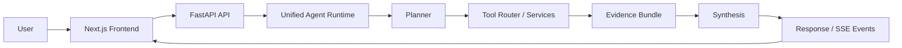

# Stock Intelligence Copilot

**Stock Intelligence Copilot** is a full-stack AI investment research and portfolio intelligence platform. It combines a FastAPI backend, a Next.js frontend, a unified agent runtime, deterministic portfolio calculations, evidence aggregation, streaming copilot responses, and a Wealth Studio workspace for personal portfolio review.

The project is built for research, education, and demo use. It is not financial advice, does not predict guaranteed returns, and should describe portfolio signals as heuristic estimates or suggested review items.

## Current Product Status

The app has evolved from a stock lookup tool into a broader investment copilot:

- Research, Explain, and Trade copilot flows are available.
- Wealth Studio supports holdings input, portfolio analysis, scenario simulation, and scenario comparison.
- Portfolio calculations use deterministic formulas for cost basis, current value, unrealized gain/loss, and return percentage.
- Stress testing, Signal Engine work, evidence aggregation, and provenance-aware insights are active product directions.
- SSE streaming includes cancellation cleanup so Stop, refresh, navigation, and aborted requests do not silently leave orphaned streams.
- Runtime and fallback errors are expected to return non-2xx HTTP statuses instead of successful `200` responses with error payloads.

## Feature Highlights

- **Copilot Research**: ticker-level research for US and Taiwan stocks, ETFs, and funds.
- **Explain Mode**: price-move explanation with ranked drivers and caveats.
- **Trade Mode**: structured setup analysis with risk framing.
- **Watchlist Monitoring**: multi-symbol monitoring and relative signal review.
- **Wealth Studio**: portfolio workspace for holdings, analysis, scenario review, and AI portfolio coaching.
- **Portfolio Analysis**: concentration, allocation, income, missing data, and gain/loss review.
- **Scenario Builder**: compare sell, buy, concentration reduction, and add-position scenarios while preserving backend payload shape.
- **Stress Testing**: evaluate portfolio sensitivity under hypothetical downside or thematic pressure.
- **Signal Engine**: relative signal layer for market, portfolio, and watchlist review.
- **Evidence / Provenance**: source-aware architecture for news, filings, fundamentals, and analyst-style signals.

## Architecture Summary


```mermaid
flowchart LR
    U["User"] --> F["Next.js Frontend"]
    F --> A["FastAPI API"]
    A --> R["Unified Agent Runtime"]
    R --> P["Planner"]
    P --> T["Tool Router / Services"]
    T --> E["Evidence Bundle"]
    E --> S["Synthesis"]
    S --> O["Response / SSE Events"]
    O --> F
```

Core modules:

- `backend/main.py`: FastAPI app, route assembly, request/response wiring
- `backend/schemas/agent.py`: shared runtime task/result contracts
- `backend/pipeline/agent_runtime.py`: unified execution entrypoint
- `backend/pipeline/route_adapters.py`: route-to-runtime adapters
- `backend/api/agent_presentation.py`: non-streaming response presentation
- `backend/api/agent_streaming.py`: SSE streaming adapter and cancellation handling
- `backend/services/portfolio_calculator.py`: deterministic portfolio calculations
- `backend/pipeline/portfolio_orchestrator.py`: portfolio analysis and scenario workflows
- `frontend/stock-ui/src/app/copilot/page.tsx`: copilot UI
- `frontend/stock-ui/src/app/portfolio/page.tsx`: Wealth Studio UI
- `frontend/stock-ui/src/lib`: frontend API, ticker, and state helpers

## Runtime Migration

The backend is converging on this shared contract:

```text
AgentTask -> Planner -> Tool Router / Evidence -> Synthesis -> AgentResult
```

Runtime-backed routes include:

- `POST /api/research`
- `POST /api/explain`
- `POST /api/trade`
- `POST /api/watchlist`
- `POST /api/portfolio/analyze`
- `POST /api/portfolio/scenario`
- `POST /api/portfolio/scenarios/compare`
- `POST /api/portfolio/agent`

Streaming routes include:

- `POST /api/research/stream`
- `POST /api/explain/stream`
- `POST /api/trade/stream`

The streaming adapter preserves the existing frontend SSE event contract while supporting safer cancellation and disconnect cleanup.

## Supported Ticker Inputs

- US symbols: `NVDA`, `AAPL`, `TSLA`
- Taiwan numeric codes: `2330`, `2317`, `2454`
- Taiwan ETF / fund codes: `00878`, `00687B`
- Yahoo-style Taiwan symbols: `2330.TW`, `2317.TW`, `2454.TW`
- Taiwan aliases: `台積電`, `鴻海`, `聯發科`, `TSMC`, `Foxconn`, `MediaTek`

Examples:

- `2330` -> `2330.TW`
- `台積電` -> `2330.TW`
- `TSMC` -> `2330.TW`
- `NVDA` -> `NVDA`

## Project Structure

```text
stock_intelligence_copilot/
├── backend/
│   ├── api/
│   ├── chains/
│   ├── pipeline/
│   ├── schemas/
│   ├── services/
│   ├── tools/
│   └── main.py
├── frontend/stock-ui/
│   ├── src/app/
│   ├── src/components/
│   ├── src/i18n/
│   └── src/lib/
├── tests/
├── docs/
├── AGENTS.md
├── SKILL.md
├── Dockerfile
├── Makefile
├── docker-compose.yml
├── pyproject.toml
└── requirements.txt
```

## Environment Variable and API Key Policy

Do not introduce paid APIs, new LLM APIs, model training, embeddings, vector databases, cloud resources, or new API keys without asking Yuni first.

Existing provider variables should be treated as optional or environment-specific unless the active workflow requires them:

```bash
cp .env.example .env
cp backend/.env.example backend/.env
```

The backend loads variables from `backend/.env`.

Common variables:

- `OPENAI_API_KEY`
- `ALPHA_VANTAGE_API_KEY`
- `NEXT_PUBLIC_BACKEND_BASE_URL`
- `BACKEND_CORS_ORIGINS`
- `ENABLE_LLM_TRADE_SYNTHESIS`
- `LANGCHAIN_API_KEY`
- `LANGCHAIN_TRACING_V2`
- `LANGCHAIN_PROJECT`

Trade synthesis should remain deterministic by default for stable demos. Optional LLM-backed paths must stay feature-flagged and clearly described as optional.

## Local Setup

Prerequisites:

- Python 3.11+
- Node.js 20+ or 22+
- npm

Backend:

```bash
python3 -m venv .venv
./.venv/bin/pip install -r requirements.txt
```

Frontend:

```bash
cd frontend/stock-ui
npm ci
```

Makefile helpers:

```bash
make install-backend
make install-frontend
```

## Safe Local Dev Workflow

This project has a documented local development hazard: opening `localhost:3000` previously caused severe memory spikes and Mac freezes.

Likely contributors were:

- Next 16 development toolchain behavior
- Turbopack
- `reactCompiler: true`
- `nxnode.bin` / `next-server` memory growth

The safer setup is:

- `reactCompiler: false`
- frontend dev script uses `next dev --webpack`
- curl-first checks before opening a browser

Start servers only when needed:

```bash
./.venv/bin/python -m uvicorn backend.main:app --reload --host 0.0.0.0 --port 8000
```

```bash
cd frontend/stock-ui
npm run dev
```

Before opening a browser, use:

```bash
curl -I http://localhost:3000
curl -I http://localhost:3000/copilot
curl -I http://localhost:3000/portfolio
curl -I http://localhost:8000/health
```

Only after curl checks pass, open a browser manually. Safari Private Window is preferred for memory testing.

Normal local dev memory can rise briefly, for example from around 500 MB to 700 MB, then settle. A danger sign is memory continuously rising into multiple GB and not dropping.

For more detail, see [Local Development Troubleshooting](docs/local-dev-troubleshooting.md).

## Running Locally

Backend API:

```bash
./.venv/bin/python -m uvicorn backend.main:app --reload --host 0.0.0.0 --port 8000
```

Frontend:

```bash
cd frontend/stock-ui
npm run dev
```

CLI examples:

```bash
./.venv/bin/python backend/main.py research NVDA
./.venv/bin/python backend/main.py explain 2330
./.venv/bin/python backend/main.py trade TSLA
./.venv/bin/python backend/main.py watchlist AAPL NVDA 2330
```

## Key API Routes

Ticker and copilot routes:

- `POST /api/research`
- `POST /api/explain`
- `POST /api/trade`
- `POST /api/watchlist`
- `POST /api/research/stream`
- `POST /api/explain/stream`
- `POST /api/trade/stream`

Portfolio routes:

- `POST /api/portfolio/analyze`
- `POST /api/portfolio/scenario`
- `POST /api/portfolio/scenarios/compare`
- `POST /api/portfolio/agent`
- `POST /api/portfolio/save`
- `GET /api/portfolio/current`
- `PUT /api/portfolio/current`
- `DELETE /api/portfolio/current`
- `GET /api/portfolio/list`

## Error Handling Overview

The app should preserve frontend-compatible error fields while using correct HTTP semantics:

- Successful responses remain 2xx.
- Validation or user-input errors should return 400 or 422.
- Runtime, tool, provider, or fallback failures should return 500 or 502.
- Error responses should avoid internal tracebacks, secrets, or provider credentials.
- Runtime failure must not be represented as HTTP 200 with an error payload.

## SSE Streaming and Cancellation

Streaming routes support live milestone events for Research, Explain, and Trade flows.

Safety expectations:

- Stop, refresh, navigation, and request abort should cancel frontend fetch readers.
- Frontend readers should be cancelled and release their stream locks.
- Backend stream generators should handle cancellation, `GeneratorExit`, and disconnect checks safely.
- Cancelled streams should not emit final success events.
- Long-running agent work should not continue silently after the client disconnects.

## Testing Commands

Backend tests:

```bash
./.venv/bin/python -m unittest discover -s tests -v
```

Backend lint:

```bash
./.venv/bin/python -m ruff check backend tests
```

Frontend lint:

```bash
cd frontend/stock-ui
npm run lint
```

Focused frontend lint example:

```bash
cd frontend/stock-ui
npm run lint -- src/app/portfolio/page.tsx
```

Use lightweight, relevant tests first. Do not run Playwright or browser automation unless explicitly requested.

## Demo Readiness Notes

Strong demo path:

1. Open the home page after curl checks pass.
2. Show Copilot Research with a familiar ticker.
3. Switch to Explain or Trade to show task-specific workflows.
4. Open Wealth Studio.
5. Add or load a small portfolio.
6. Run Analyze Holdings.
7. Highlight deterministic metrics: Current Value, Cost Basis, Unrealized Gain/Loss, Return %.
8. Show heuristic portfolio snapshot and data quality caveats.
9. Run a scenario or scenario comparison.
10. Ask AI Portfolio Coach for a cautious review item.

Avoid presenting heuristic scores as objective ratings. Use phrasing like "relative signal", "stress test", and "suggested review item."

## Financial Safety and Wording

This project must not imply:

- guaranteed returns
- price prediction certainty
- personalized regulated investment advice
- objective investment ratings when the value is heuristic

Preferred language:

- heuristic estimate
- relative signal
- stress test
- suggested review item
- data quality caveat
- not financial advice

Any number shown in the UI or generated output should come from user input, deterministic calculation, fetched tool output, or explicit source metadata. If data is missing, say it is missing.

## Portfolio Insight Limitations

Portfolio insights combine deterministic calculations and heuristic estimates.

Deterministic examples:

- cost basis = shares * average cost
- current value = shares * current price
- unrealized gain/loss = current value - cost basis
- return percentage = unrealized gain/loss / cost basis

Heuristic examples:

- diversification estimate
- concentration estimate
- defensive allocation estimate
- growth tilt estimate
- theme or sector exposure tags when full look-through data is unavailable

Heuristic values should be presented as approximate and non-advisory.

## Deployment Notes

The full stack can run locally or be deployed as separate frontend/backend surfaces.

Frontend-only static deployment:

- GitHub Pages can host the static frontend export.
- The backend must run separately, for example on Cloud Run.
- `NEXT_PUBLIC_BACKEND_BASE_URL` must point to the deployed backend origin.

Backend deployment:

- Cloud Run is the recommended backend deployment target.
- Store secrets in a secret manager, not in Git.
- Confirm CORS allows the deployed frontend origin.

Do not add new cloud resources or paid services without approval.

## Troubleshooting

Missing environment variables:

- backend starts but provider-backed requests fail
- synthesis or news paths may return fallback responses
- check `backend/.env` and deployment secret settings

CORS issues:

- confirm backend runs on port `8000`
- confirm frontend runs on port `3000`
- set `BACKEND_CORS_ORIGINS` for deployed frontend origins

Streaming fallback:

- some proxies buffer SSE
- if streaming is blocked, the frontend may fall back to a standard response
- cancellation should still clean up stream readers and backend generators

Local frontend memory:

- avoid opening localhost first
- use curl-first checks
- keep React Compiler disabled for local memory testing
- use webpack dev mode instead of Turbopack unless explicitly testing Turbopack

## Roadmap

Near-term roadmap:

- **Week 1: Wealth Studio refactor**
  - improve holdings UX
  - simplify portfolio insights
  - strengthen bilingual labels and empty states

- **Week 2: Portfolio Stress Test**
  - add clearer stress scenarios
  - show before/after exposure changes
  - keep all stress output framed as hypothetical

- **Week 3: Signal Engine**
  - refine relative signals
  - improve source metadata
  - connect signals to evidence provenance

- **Week 4: Portfolio Intelligence**
  - improve concentration analysis
  - improve sector exposure
  - add risk attribution and watchlist monitoring hooks

Future ML, embeddings, vector databases, model training, paid APIs, or new cloud resources should only be added after explicit approval.
